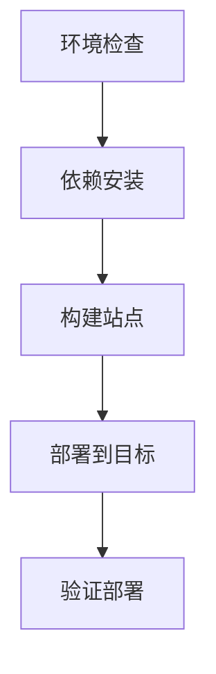
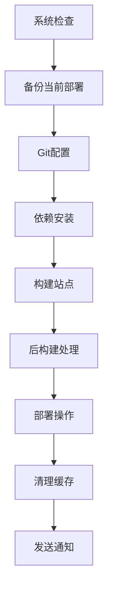

# 🚀 Hexo 博客完整部署指南

## 📖 概述

本项目提供了一套完整的 Hexo 博客自动化部署解决方案，涵盖从本地开发到生产部署的全流程。

## 🛠️ 部署工具总览

### 核心脚本

| 脚本 | 功能 | 使用场景 |
|------|------|----------|
| `deploy.sh` | 基础部署脚本 | 简单快速的部署 |
| `advanced-deploy.sh` | 高级部署脚本 | 企业级部署需求 |
| `workflow-deploy.sh` | 工作流脚本 | 复杂部署场景 |
| `monitor-deploy.sh` | 监控脚本 | 部署状态监控 |
| `test-deploy.sh` | 测试脚本 | 环境验证 |

### 配置文件

| 文件 | 用途 | 重要性 |
|------|------|--------|
| `.env` | 环境变量配置 | 🔴 必需 |
| `deploy-config.sh` | 部署参数配置 | 🔴 必需 |
| `env-example.txt` | 配置模板 | 🔵 推荐 |

## ⚡ 快速开始

### 1. 环境配置

```bash
# 复制配置模板
cp env-example.txt .env

# 编辑配置
vim .env
```

### 2. 权限设置

```bash
# 给所有脚本添加执行权限
chmod +x *.sh
```

### 3. 环境测试

```bash
# 运行完整测试
./test-deploy.sh all

# 检查特定项目
./test-deploy.sh system    # 系统要求
./test-deploy.sh git       # Git配置
./test-deploy.sh build     # 构建测试
```

### 4. 执行部署

```bash
# 基础部署
./deploy.sh --all

# 高级部署
./advanced-deploy.sh deploy

# 工作流部署
./workflow-deploy.sh new-post "我的新文章"
```

## 📋 部署流程详解

### 基础部署流程



### 高级部署流程



## 🎯 不同场景的部署方案

### 场景1：日常文章发布

```bash
# 使用工作流脚本
./workflow-deploy.sh new-post "Spring Boot最佳实践"

# 或者手动流程
hexo new post "Spring Boot最佳实践"
# 编辑文章...
./advanced-deploy.sh deploy-all
```

### 场景2：批量内容更新

```bash
# 批量更新所有文章
./workflow-deploy.sh bulk-update

# 检查更新结果
./monitor-deploy.sh -p -o update-report.md
```

### 场景3：性能优化部署

```bash
# 执行性能优化
./workflow-deploy.sh performance-optimize

# 监控优化效果
./monitor-deploy.sh -p
```

### 场景4：SEO优化

```bash
# 执行SEO优化
./workflow-deploy.sh seo-optimize

# 检查SEO效果
./monitor-deploy.sh -u https://your-site.com -p
```

### 场景5：备份和迁移

```bash
# 创建完整备份
./workflow-deploy.sh backup-migrate /tmp/blog-backup

# 迁移到新位置
./workflow-deploy.sh backup-migrate /tmp/backup /new/location
```

## 🔧 配置选项详解

### 环境变量配置

```bash
# Git配置
GIT_USER_NAME="你的用户名"
GIT_USER_EMAIL="你的邮箱"

# 部署配置
DEPLOY_BRANCH="gh-pages"
SOURCE_BRANCH="main"
CNAME="your-domain.com"

# API密钥
OPENAI_API_KEY="your-openai-key"
AMAP_API_KEY="your-amap-key"

# 性能配置
ENABLE_CACHE=true
ENABLE_MINIFY=false
ENABLE_COMPRESS=true

# 备份配置
ENABLE_BACKUP=true
BACKUP_RETENTION=7

# 通知配置
NOTIFICATION_WEBHOOK="https://hooks.slack.com/xxx"
```

### 高级配置选项

```bash
# 自定义构建命令
PRE_BUILD_COMMAND="npm run prebuild"
POST_BUILD_COMMAND="npm run postbuild"

# 服务器部署
CUSTOM_SERVER_HOST="your-server.com"
CUSTOM_SERVER_USER="deploy"
CUSTOM_SERVER_PATH="/var/www/html"

# 日志配置
LOG_LEVEL="info"
LOG_FILE="deploy.log"
```

## 🚀 CI/CD 集成

### GitHub Actions 配置

项目已包含完整的 GitHub Actions 配置：

```yaml
# .github/workflows/ci-cd.yml
# 功能包括：
# - 代码质量检查
# - 自动化构建部署
# - 性能监控
# - 多环境支持
```

### 手动触发部署

```bash
# 在GitHub Actions中手动触发
# 选择 workflow: CI/CD Pipeline
# 选择 environment: production/staging
# 设置参数: skip_tests=false
```

### 自动部署触发条件

- **推送主分支**: 自动部署到生产环境
- **推送开发分支**: 部署到预发布环境
- **PR到主分支**: 运行测试但不部署
- **手动触发**: 可选择环境和参数

## 📊 监控和维护

### 部署状态监控

```bash
# 监控GitHub Pages状态
./monitor-deploy.sh -r username/repo -m

# 检查网站健康
./monitor-deploy.sh -u https://your-site.com -s

# 生成健康报告
./monitor-deploy.sh -u https://your-site.com -p -o health-report.md
```

### 性能监控

```bash
# 性能分析
./monitor-deploy.sh -p

# 自定义监控脚本
#!/bin/bash
while true; do
    ./monitor-deploy.sh -u https://your-site.com -s
    sleep 3600  # 每小时检查
done
```

### 日志管理

```bash
# 查看部署日志
tail -f deploy.log

# 日志轮转
LOG_FILE="deploy.log"
if [[ $(stat -f%z "$LOG_FILE" 2>/dev/null || stat -c%s "$LOG_FILE") -gt 10485760 ]]; then
    mv "$LOG_FILE" "${LOG_FILE}.$(date +%Y%m%d_%H%M%S)"
fi
```

## 🔧 故障排除

### 常见问题

#### 1. 权限问题
```bash
# 检查文件权限
ls -la *.sh

# 添加执行权限
chmod +x *.sh
```

#### 2. 构建失败
```bash
# 清理缓存重新构建
hexo clean
rm -rf node_modules
npm install
hexo generate
```

#### 3. 部署失败
```bash
# 检查Git配置
git remote -v
git config --list

# 检查GitHub Token
curl -H "Authorization: token YOUR_TOKEN" https://api.github.com/user
```

#### 4. 网络问题
```bash
# 测试网络连接
curl -I https://api.github.com
curl -I https://github.com

# 检查DNS
nslookup github.com
```

### 调试模式

```bash
# 启用详细日志
export LOG_LEVEL=debug
./advanced-deploy.sh deploy

# 手动执行每一步
hexo clean
hexo generate --debug
hexo deploy --debug
```

## 🎯 最佳实践

### 开发流程

1. **创建特性分支**
   ```bash
   git checkout -b feature/new-article
   ```

2. **开发和测试**
   ```bash
   hexo server --draft  # 本地预览
   ./test-deploy.sh all # 环境测试
   ```

3. **提交和部署**
   ```bash
   git add .
   git commit -m "Add new article"
   git push origin feature/new-article
   ```

4. **合并到主分支**
   ```bash
   # 创建PR并合并
   # GitHub Actions自动部署
   ```

### 性能优化

1. **启用缓存**
   ```bash
   echo "ENABLE_CACHE=true" >> .env
   ```

2. **压缩资源**
   ```bash
   echo "ENABLE_MINIFY=true" >> .env
   echo "ENABLE_COMPRESS=true" >> .env
   ```

3. **定期优化**
   ```bash
   ./workflow-deploy.sh performance-optimize
   ```

### 安全配置

1. **保护敏感信息**
   ```bash
   # 使用GitHub Secrets
   # 不要在.env文件中存储敏感信息
   ```

2. **定期更新依赖**
   ```bash
   npm audit
   npm update
   ```

3. **备份重要数据**
   ```bash
   ./advanced-deploy.sh backup
   ```

## 📚 相关文档

- **[部署配置](./DEPLOY_README.md)** - 详细的配置说明
- **[使用示例](./deploy-examples.md)** - 实际使用案例
- **[环境配置](./env-example.txt)** - 配置模板
- **[Hexo文档](https://hexo.io/docs/)** - Hexo官方文档
- **[GitHub Pages](https://docs.github.com/pages)** - GitHub Pages文档

## 🎉 总结

这套部署解决方案提供了：

### ✅ 核心功能
- **多脚本支持**: 从简单到高级的部署选项
- **自动化CI/CD**: GitHub Actions完整集成
- **智能监控**: 部署状态和性能监控
- **工作流支持**: 针对不同场景的专用流程

### ✅ 企业级特性
- **备份恢复**: 自动备份和快速恢复
- **错误处理**: 完善的异常处理机制
- **日志记录**: 详细的部署日志
- **通知系统**: 部署状态通知

### ✅ 灵活配置
- **环境变量**: 支持多环境配置
- **自定义脚本**: 可扩展的部署流程
- **多种目标**: 支持GitHub Pages和自定义服务器

这套解决方案让Hexo博客的部署变得简单、安全、高效！🚀

---

**维护者**: 博客作者
**最后更新**: 2024-01-17
**版本**: v2.0.0
